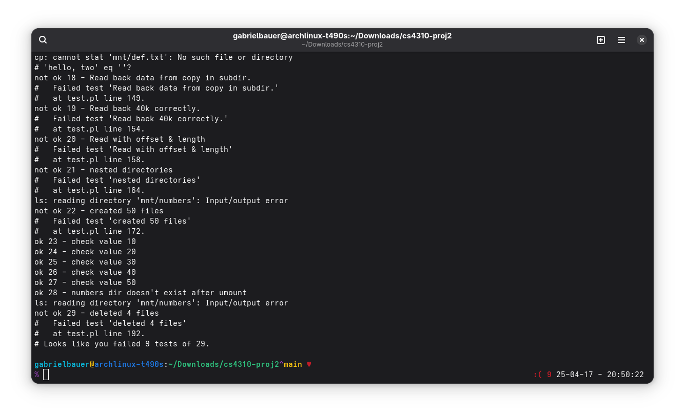

## Hey! So...funny thing!

In the files which end in ".new" contains code from my attempts at getting the code to work according to the actual specifications of the Unix FileSystem.

I was mostly successful in my standalone version of the code. Everything worked as intended, and it was actually following the guideline of the filesystem. The other version of the code, which does not actually entirely follow the actual specifications of the Unix FileSystem where a directory is just a file with dirents in it, consisting of inodes pointing to those dirents in memory, on my system consistently, time and time again, says that it successfully runs 20/29 tests. That would put your auto-grader on your server way off from what I am actually getting on my machine. And I can show this, too.

